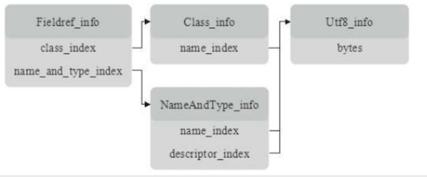

# jvm-go
go实现JVM

## 编译
指定目录编译为可执行文件
``` shell
go build -o /Users/edy/Documents/study/golang/jvm-go
```
## 使用
-Xjre 指定jar包路径
```shell
jvm-go -Xjre "/Library/Java/JavaVirtualMachines/jdk-1.8.jdk/Contents/Home/jre" java.lang.String
```

## 常量池
### 常量引用关系


