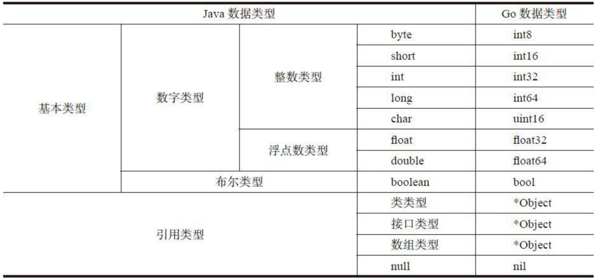
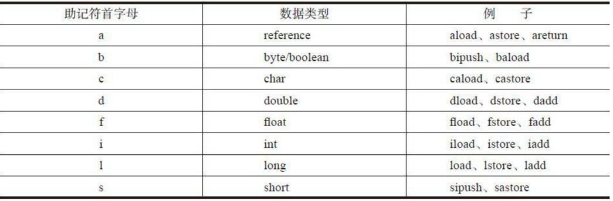

# jvm-go
go实现JVM

## 编译
指定目录编译为可执行文件
``` shell
go build -o /Users/edy/Documents/study/golang/jvm-go
```
## 使用
-Xjre 指定jar包路径
```shell
jvm-go -Xjre "/Library/Java/JavaVirtualMachines/jdk-1.8.jdk/Contents/Home/jre" java.lang.String
```

## 数据类型映射



## 常量引用关系


## 指令集

### 概念

字节码中存放编码后的Java虚拟机指令。每条指令都以一个单字节的操作码（opcode）开头，这就是字节码名称的由来。由于只使 用一字节表示操作码，显而易见，Java虚拟机最多只能支持256（28 ） 条指令。

Java虚拟机规范把已经定义的205条指令按用途分成了11类， 分别是：
- 常量（constants）指令:常量指令把常量推入操作数栈顶。常量可以来自三个地方：隐含在操作码里、操作数和运行时常量池。
- 加载（loads）指令
- 存储（stores）指令
- 操作数栈（stack）指令
- 数学（math）指令
- 转换（conversions）指令
- 比较（comparisons）指令
- 控制（control）指令
- 引用（references）指令
- 扩展（extended）指令
- 保留（reserved）指令

#### 保留指令
保留指令一共有三条，这三条指令不允许出现在class文件中

- 其中一条是留给调试器的，用于实现断点，操作码是202（0xCA），助记符是breakpoint。
- 另外两条留给Java 虚拟机实现内部使用，操作码分别是254（0xFE）和266（0xFF），助记 符是impdep1和impdep2。


### 助记符首字母和变量类型对应表


